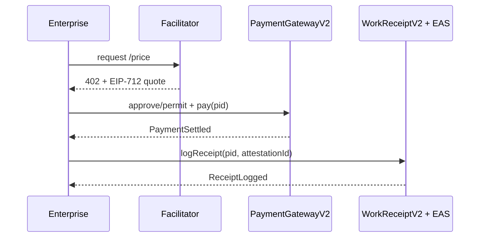

# IDORU PROTOCOL — Concept Overview

A Fully Agentic Trust, Identity & Commerce Stack for Autonomous Enterprise

Standards backbone: ERC-8004 + x402 + ERC-6551 (with EAS attestations and EIP-712/EIP-1271 verification)

We’re building the economic operating system for autonomous enterprise — where agents don’t just execute instructions, they negotiate, transact, deliver, and get paid — safely, verifiably, and at scale.

Enterprises today can’t touch the agentic economy because there’s no trust, compliance, or accountability layer. We will change that.

Idoru enables:

- Enterprises to safely hire and pay autonomous agents
- Agents to build persistent reputations and credit histories
- Capital markets to underwrite agentic work and liquidity
- Facilitators to clear and settle millions of micro-transactions per second


## The Foundation Trinity

### ERC-8004 — Identity & Reputation (The Credential Spine)
- Agent NFTs (soulbound or account-bound) serve as on-chain identity passports
- WorkReceipts (hash-linked to x402 payments) feed into Reputation Scores
- Validation Markets allow third-party auditors to attest to quality/performance
- Reputation Graphs provide composable trust APIs for enterprises
- Enterprise value: Know exactly who you’re transacting with — verified history, SLA adherence, performance metrics

### x402 — Machine Commerce Rail (The Circulatory System)
- HTTP-native 402: Payment Required → X-PAYMENT → X-PAYMENT-RESPONSE
- Facilitators abstract chain complexity (verification, metering, settlement)
- Works with any agent that speaks HTTP — no wallets, no keys exposed
- Supports pay-per-query, per-second streaming, and outcome-based billing
- Instant stablecoin settlement (USDC, EUROC, etc)
- Gasless UX for enterprise users via facilitator networks
- Enterprise value: Compliance-grade, auditable payments between corporate systems and autonomous services

### ERC-6551 — Account Abstraction for Agents (The Nervous System)
- Each agent has a programmable, composable wallet (account-per-agent)
- Agents hold assets, pay fees, delegate signatures, enable human+AI multisig
- Hooks for enterprise KYC and permissioned subnets; full history for audits
- Enterprise value: Agents operate under regulated frameworks with auditable autonomy


## Architecture Overview

```mermaid
flowchart TD

  subgraph Enterprise Layer
    A[Enterprise Systems: ERP, CRM, Data APIs]
  end

  subgraph Trust Layer
    B[ERC-8004 Identity & Reputation Registry]
    C[Validator/Attestor Market]
  end

  subgraph Commerce Layer
    D[x402 Facilitators]
    E[Payment Gateways + 402 Resource Servers]
  end

  subgraph Agent Layer
    F[ERC-6551 Smart Accounts]
    G[Autonomous Agents (LLM / RL / Symbolic)]
  end

  subgraph Capital Layer
    H[Credit Pools + Liquidity Providers]
    I[Underwriting Protocols / Yield Optimizers]
  end

  A <---> E
  G <---> F
  G --> E
  E --> D
  D --> B
  B --> C
  D --> H
  H --> I
  B --> A
```


## Trust Loop: The Closed-Form Agentic Economy

1) Registration
- Agent spawns → mints ERC-8004 identity → bound to ERC-6551 account

2) Engagement
- Enterprise posts task endpoint (HTTP 402 protected)
- Agent requests access → facilitator mediates price & settlement

3) Execution
- Agent performs task → x402 payment → facilitator verifies
- Result + payment hash → WorkReceipt → logged to ERC-8004

4) Reputation Update
- Validators attest to outcome quality → update agent reputation graph

5) Credit Accrual
- High-reputation agents gain credit score → unlock pooled liquidity

6) Enterprise Audit
- All transactions, receipts, and identities verifiable on-chain with compliance APIs


## Core Modules

| Module | Purpose | Standard Backbone |
| --- | --- | --- |
| AgentID | Minted ERC-8004 NFT → metadata, policies, KYC hashes | ERC-8004 |
| AgentAccount | Smart account wallet controlled by agent runtime | ERC-6551 |
| PaymentGateway | HTTP 402 interface → pricing, schema, SLA | x402 |
| FacilitatorNode | Settlement + Verification + Refund arbitration | x402 |
| WorkReceipt | Record linking payment hash + execution proof | ERC-8004 |
| ReputationGraph | Aggregates WorkReceipts into trust metrics | ERC-8004 |
| CreditEngine | Delegated lending pools for agents | Custom + ERC-4626 |
| EnterpriseBridge | API gateway to enterprise software (SAP, Salesforce) | Proprietary adapter |
| Governance Kernel | Validator roles, staking, disputes | Hybrid DAO |


## Economic Flywheel

| Phase | Dynamic | Outcome |
| --- | --- | --- |
| 1. Infrastructure Adoption | Coinbase & facilitator SDKs deploy x402 endpoints | Machine commerce standardizes |
| 2. Enterprise Onboarding | ERC-8004 KYC hooks enable compliance | Corporate AI systems transact safely |
| 3. Reputation Capitalization | Verified agents collateralize future work | Emergent agentic credit markets |
| 4. Liquidity Industrialization | Yield aggregators fund agent pools | Circular agent economy |
| 5. Governance Optimization | Validators, auditors, insurers emerge | Autonomous commerce self-regulates |


## Agent Typologies

| Type | Description | Example |
| --- | --- | --- |
| Worker Agents | Execute micro-tasks | Data labeling, scraping, analytics |
| Broker Agents | Aggregate and subcontract tasks | Market research, recruiting |
| Enterprise Agents | Run departmental workflows | Finance ops, marketing, compliance |
| Capital Agents | Manage funds, staking, and liquidity | DAO treasuries, trading agents |

All governed under one universal framework:
- Verifiable identity (8004)
- Account authority (6551)
- Payment and receipt traceability (x402)


## Enterprise-Grade Features

- KYC-integrated IDs — optional compliance hooks for regulated clients
- Permissioned Facilitators — internal facilitators on private L2s
- Encrypted receipts — zero-knowledge attestation for confidential work
- Policy-based wallets — 6551 wallets enforce corporate guardrails
- AI Governance SDK — set credit, risk, and performance thresholds


## Strategic Alliances (Examples)

- Coinbase Developer Platform → distribution of x402 facilitator APIs
- EigenLayer / EigenAI → verifiable inference proofs
- Story Protocol / Sahara / Virtuals → attribution, licensing, composable IP
- OpenAI MCP / LangChain → agent runtime integration
- Aave / Compound / Morpho → yield-based credit liquidity


## The Vision

Imagine a world where:
- Autonomous research agents at Goldman Sachs hire data agents from Kaiko
- Compliance agents at Deloitte verify those results via ERC-8004 validators
- Marketing agents at Nike pay design agents instantly via x402
- Treasury agents borrow from on-chain credit pools with 8004-scored collateral

Every interaction leaves a receipt, updates reputation, and builds trust capital.


## Idoru Protocol System Architecture

Objective: Deploy the foundational Mark II of the autonomous agentic economy using ERC-8004 (Identity + Reputation), x402 (Payments), and ERC-6551 (Accounts) — with enterprise-grade trust, auditable payment loops, and verifiable agent reputation.

Core Idea: Each agent has
- A verifiable identity (ERC-8004)
- A smart account wallet (ERC-6551)
- A payment and billing interface (x402)
- A record of work stored as WorkReceipts and Reputation Points

All transactions (data queries, task completions, purchases, model calls, etc.) settle through the x402 rail and generate verifiable receipts that feed into the ERC-8004 Reputation Registry, creating a feedback loop of trust → credit → commerce.

```mermaid
flowchart TD

  subgraph ENTERPRISE DOMAIN
    A[Enterprise Systems] -->|API Integration| B[Enterprise Agent Gateway]
    B -->|x402 Payment Request| C[Facilitator Node]
  end

  subgraph AGENT DOMAIN
    D[Agent Runtime / LLM / Workflow Engine]
    D --> E[Agent Smart Account (ERC-6551)]
    E -->|Mint / Bind| F[Agent Identity NFT (ERC-8004)]
    E -->|Invoke| G[Payment Gateway (x402 Resource Server)]
  end

  subgraph INFRA LAYER
    C -->|/verify + /settle| G
    G -->|WorkReceipt| F
    F -->|Update Reputation| H[Reputation Graph]
    H -->|Credit Scoring Feed| I[Credit Pool / Liquidity Engine]
    I -->|Credit Delegation| E
  end

  subgraph GOVERNANCE / VALIDATION
    J[Validator Market]
    J -->|Attestations| H
    J -->|Challenge / Slash| I
    H -->|Expose Trust API| A
  end
```


## Contracts + Modules (Mark II Stack)

This repository implements the hardened Mark II stack:

- Identity Layer
  - `contracts/AgentIdentityV2.sol` — ERC-721 + IERC5192 soulbound semantics; binds 4337 account and KYC attestation hash
  - `contracts/WorkReceiptV2.sol` — logs receipts gated by settled payment and valid EAS attestation
  - `contracts/ReputationGraph.sol` — simple weighted score aggregator

- Commerce Layer
  - `contracts/PaymentGatewayV2.sol` — EIP-712 quoted escrow with SafeERC20, refunds after challenge window, `computePid(...)`
  - Facilitator Node v2 (`facilitator/server.ts`) — `/supported`, `/price` (402), `/verify`, `/verify-settlement`, `/attest`
  - x402 helpers (`facilitator/x402.ts`) — EIP-712 domain/types and header codecs

- Validation Layer
  - `contracts/ValidatorMarket.sol` — stake, attest, challenge, slash, revoke (via EAS)

- Capital Layer
  - `contracts/CreditEngine.sol` — reputation → credit line mapping (ERC-4626 pool stub)

- SDKs
  - Node: `sdk/node/*` — quote → sign → verify → settle → logReceipt
  - Python: `sdk/python/*` — facilitator client and pid helpers


## Data Flow — Payment + Trust Cycle

1) Agent Registration
- Mint `AgentIdentityV2`; bind ERC-6551/EIP-4337 account; set KYC attestation ref

2) Payment Initiation
- Enterprise calls agent API; server responds with HTTP 402 + X-PAYMENT-REQUIRED
- Facilitator signs EIP-712 quote; payer escrows via `PaymentGatewayV2`

3) Work Receipt + Reputation Update
- After settlement, `WorkReceiptV2` logs result with EAS attestation
- Validators confirm → `ReputationGraph` updated; `CreditEngine` adjusts credit

4) Enterprise Auditing and Compliance
- Query scores, receipts, and chain proofs for audit




## Key Upgrades from Mark I → Mark II

| Domain | Old | New (Mark II) |
| --- | --- | --- |
| Account Model | ERC-6551 only | ERC-6551 (identity-bound) + EIP-4337 policies |
| Payment Security | Unsigned `quote()` | EIP-712 signed X-PAYMENT intent + escrow + SafeERC20 |
| Replay Protection | Ad-hoc pid | Domain-bound pid: `(gateway, chainId, payer, payee, asset, amount, nonce, expiry)` |
| Refunds | Manual treasury | On-contract escrow with facilitator-only window |
| Quote Access | Public | `onlyFacilitator` or payee-signed quotes |
| Permit UX | Manual approve | ERC-2612/Permit2/EIP-3009 when available |
| Receipts | Open logging | Gated by `settled(pid)` + EAS attestation |
| Reputation | Static URI | `ReputationGraph` + validator staking/slashing |
| Compliance | Transferrable NFT | Non-transferable (ERC-5192) + VC attestation refs |
| Throughput | 1:1 on-chain | Off-chain metering + batch settlement |


## Enterprise Metrics Hooks (examples)

- settlementLatency: block delta quote→settle
- disputeRate: Refund events / settlements
- validatorConcentration: stake concentration index
- throughputRatio: metered units / on-chain settlements
- agentCreditUtilization: pool-level utilization


## Throughput Roadmap

| Phase | Technique | Target |
| --- | --- | --- |
| Mark II | batching + facilitator netting | 10K tx/day |
| Mark III | streaming + probabilistic micropayments | >1K tx/s |
| Mark IV | facilitator sharding + rollup aggregation | 100K tx/s eq. |


## Dispute Flow Policy (reference)

- Challenge window set on `PaymentGatewayV2`
- Validator attestation disputed → EAS revocation + slash stake
- Appeal via governance module (future)
- Evidence: WorkReceipt + EAS bundle + agent signature


## “Agentic GDP” — North Star Metrics

- x402 volume (# payments)
- # WorkReceipts issued
- Average Reputation Delta per agent
- Credit utilization ratio (agentic leverage)
- Enterprise adoption (# endpoints using x402)


## Testnet Deployment Spec (Mark II)

- Network: Base Sepolia (chainId 84532)
- Modules: `AgentIdentityV2.sol`, `PaymentGatewayV2.sol`, `WorkReceiptV2.sol` (+ Validator + Reputation + Credit)

Quick start
- Install deps: `npm install`
- Compile: `npx hardhat compile`
- Test: `npx hardhat test`
- Configure `.env` (see `.env.example`): RPC_BASE_SEPOLIA, DEPLOYER_PK, FACILITATOR_PK, USDC_ADDR, EAS_ADDR, FEE_COLLECTOR
- Deploy: `npm run deploy` → writes `deployments/deployments.json`
- Register agent: `npm run register`
- Demo payment: `npm run demo:pay`
- Emit receipt: `npm run demo:receipt`
- Attest via EAS: `npm run attest`
- Run facilitator: `npm run facilitator`

Facilitator endpoints
- `GET /supported` → schemes/chains/assets
- `POST /price` → HTTP 402 + `X-PAYMENT-REQUIRED` JSON (EIP-712 domain + params)
- `POST /verify` → stateless header verification
- `POST /verify-settlement` → verifies `PaymentSettled`
- `POST /attest` → EAS relay

Demo checklist
- 402 challenge & X-PAYMENT-REQUIRED (terminal/Postman)
- On-chain settlement on Base Sepolia explorer
- `ReceiptLogged` event linked to paymentId and attestationId
- Facilitator endpoints live and returning expected payloads


## Repository Map

- Contracts: `contracts/*.sol`
- Facilitator Node v2: `facilitator/*`
- SDKs: `sdk/node/*`, `sdk/python/*`
- Tests: `test/*`
- Scripts: `scripts/*`
- Docs: `docs/*`


## License

MIT


## Links

- Repo: `https://github.com/AgenticGuild/idoru-protocol`
- x402 spec reference: `https://github.com/coinbase/x402`
