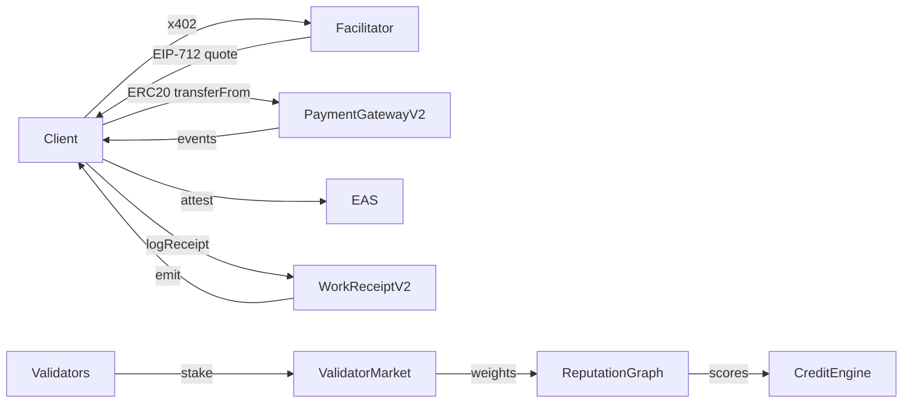
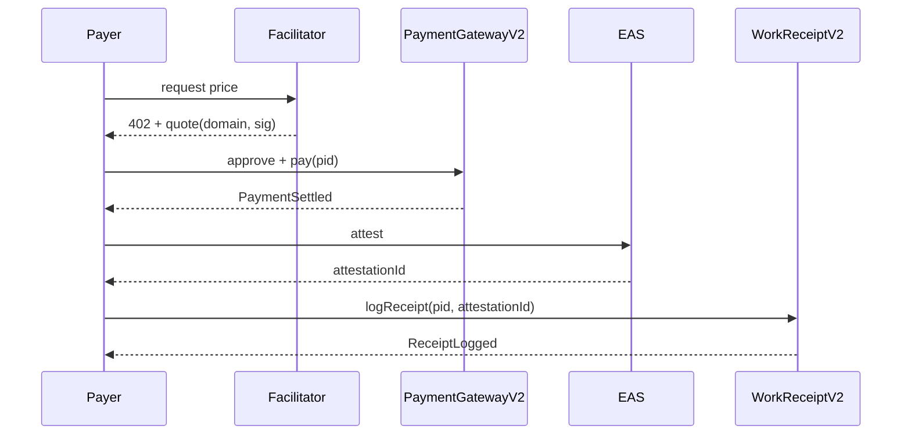

# Architecture Diagrams

```mermaid
flowchart LR
  Client -->|x402| Facilitator
  Facilitator -->|EIP-712 quote| Client
  Client -->|ERC20 transferFrom| PaymentGatewayV2
  PaymentGatewayV2 -->|events| Client
  Client -->|attest| EAS
  Client -->|logReceipt| WorkReceiptV2
  WorkReceiptV2 -->|emit| Client
  Validators -->|stake| ValidatorMarket
  ValidatorMarket -->|weights| ReputationGraph
  ReputationGraph -->|scores| CreditEngine
```

```mermaid
sequenceDiagram
  participant P as Payer
  participant F as Facilitator
  participant G as PaymentGatewayV2
  participant E as EAS
  participant W as WorkReceiptV2

  P->>F: request price
  F-->>P: 402 + quote(domain, sig)
  P->>G: approve + pay(pid)
  G-->>P: PaymentSettled
  P->>E: attest
  E-->>P: attestationId
  P->>W: logReceipt(pid, attestationId)
  W-->>P: ReceiptLogged
```

