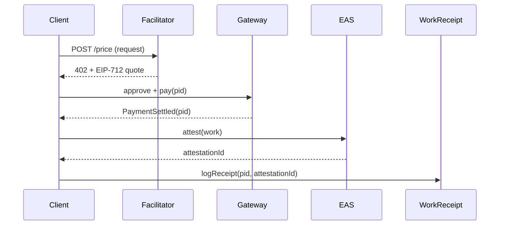
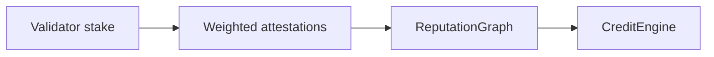

# Protocol Overview

Idoru Protocol Mark II links payments, receipts, validator reputation, and credit.

1) Payment: Facilitator quotes EIP-712 payment, payer escrows via `PaymentGatewayV2`.
2) Receipt: After settlement, work receipt logs with a valid EAS attestation.
3) Reputation: Validator stake weights drive aggregated agent reputation in `ReputationGraph`.
4) Credit: Reputation unlocks credit lines in `CreditEngine`.

