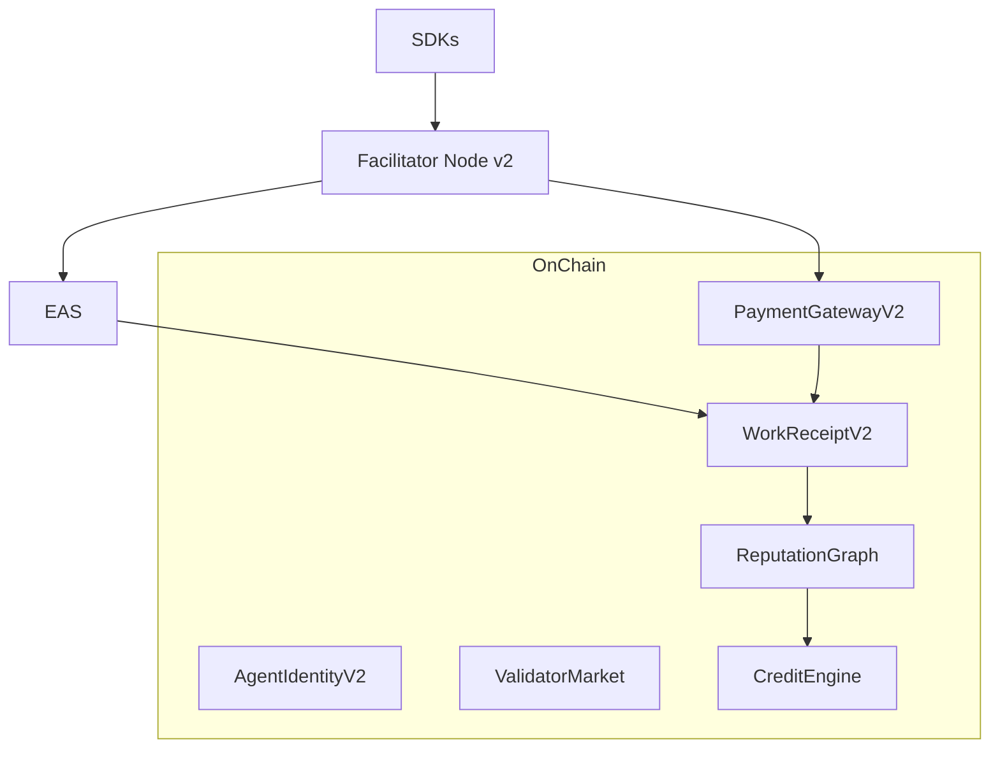
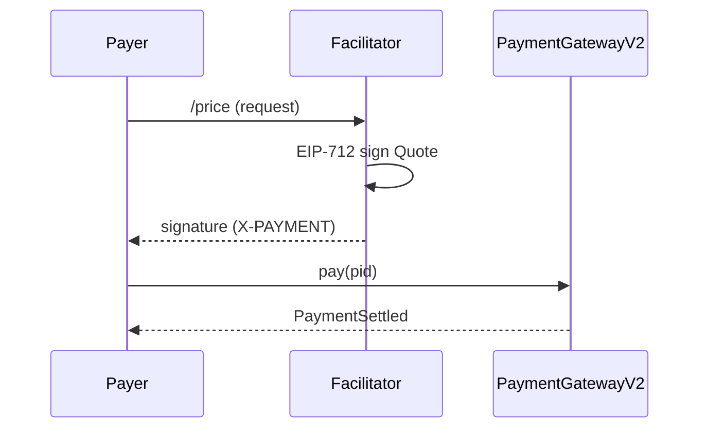

## Architecture Diagrams

### High-Level

```mermaid
flowchart TD
  subgraph OnChain
    AI[AgentIdentityV2]
    PG[PaymentGatewayV2]
    WR[WorkReceiptV2]
    VM[ValidatorMarket]
    RG[ReputationGraph]
    CE[CreditEngine]
  end
  SDK[SDKs]
  F[Facilitator Node v2]
  EAS[EAS]

  SDK --> F
  F --> PG
  F --> EAS
  EAS --> WR
  PG --> WR
  WR --> RG
  RG --> CE
```

### Quote and Settle (Sequence)

```mermaid
sequenceDiagram
  participant P as Payer
  participant F as Facilitator
  participant PG as PaymentGatewayV2

  P->>F: /price (request)
  F->>F: EIP-712 sign Quote
  F-->>P: signature (X-PAYMENT)
  P->>PG: pay(pid)
  PG-->>P: PaymentSettled
```
