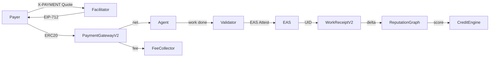

## Protocol Overview

Idoru Protocol connects payment, verification, and reputation:

- Payment → Receipt → Reputation → Credit

### Flow
1. Facilitator provides price quote (EIP-712 x402) to payer.
2. Payer settles via `PaymentGatewayV2` (escrow → split).
3. Work completes; validator submits EAS attestation.
4. `WorkReceiptV2` logs receipt, linking payment and attestation.
5. `ReputationGraph` updates agent scores.
6. `CreditEngine` grants lines based on reputation and collateral.

### Diagram

